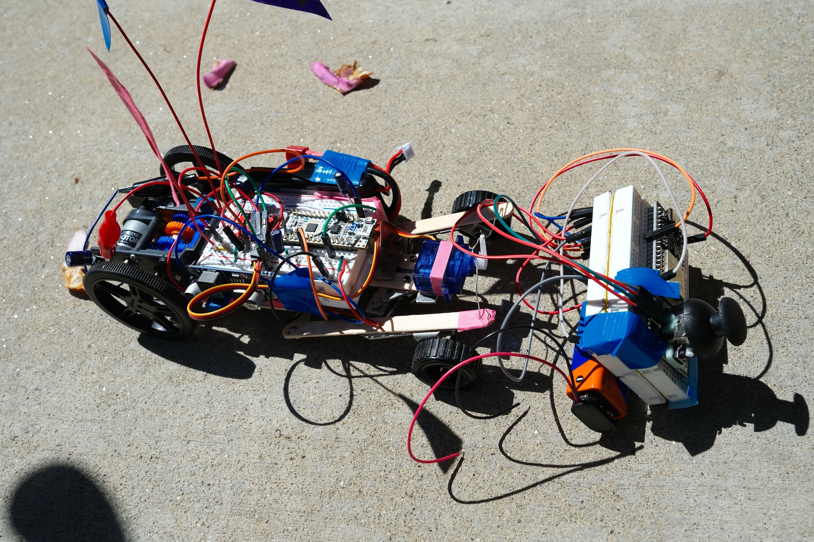
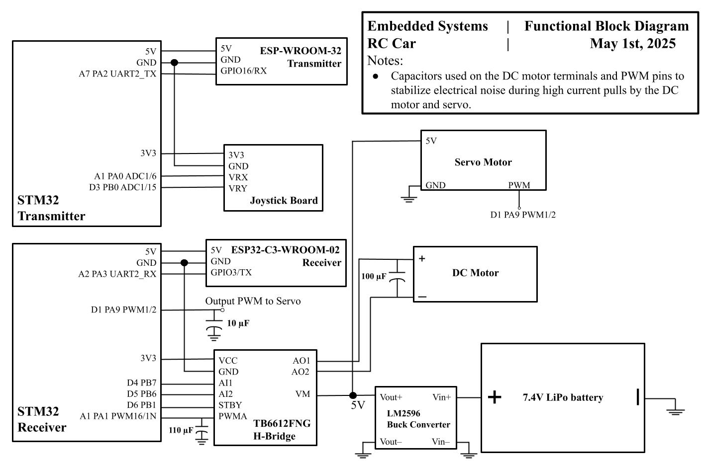

# EE14 Final Project: RC Car with STM32 & ESP32

<table>
  <tr>
    <td></td>
    <td></td>
  </tr>
</table>

## Overview

This project showcases a remote-controlled (RC) car developed as the final project for EE14. The system integrates an STM32 microcontroller with ESP32 modules to facilitate low-latency wireless control. The STM32 captures joystick inputs and sends them over UART to an ESP32, relaying the data via ESP-NOW to a second ESP32 on the car. The receiving ESP32 then sends the data via UART to the receiving STM32, which interprets that data and sets the turn angle (servo motor) and the speed of the DC motor. 

## Features

- **Dual-MCU Architecture**  
  - STM32L432KC handles analog joystick sampling and UART framing  
  - ESP32 modules handle wireless ESP-NOW communication  

- **Low-Latency Wireless**  
  - ESP-NOW peer-to-peer protocol for sub-millisecond packet delivery  

- **Modular Code Structure**  
  - Separate folders for transmitter (STM32), intermediary (ESP32), and receiver (ESP32)  
  - Clear build instructions for each  

## Hardware
- **Microcontrollers**
  - 2 STM32L432KCs. One for input data, and one for output to the motors.
  - 1 ESP-WROOM-32 (Used for transmission)
  - 1 ESP32-C3-WROOM-02 (Used for receiving data)
  - 
### Block Diagram:

)

