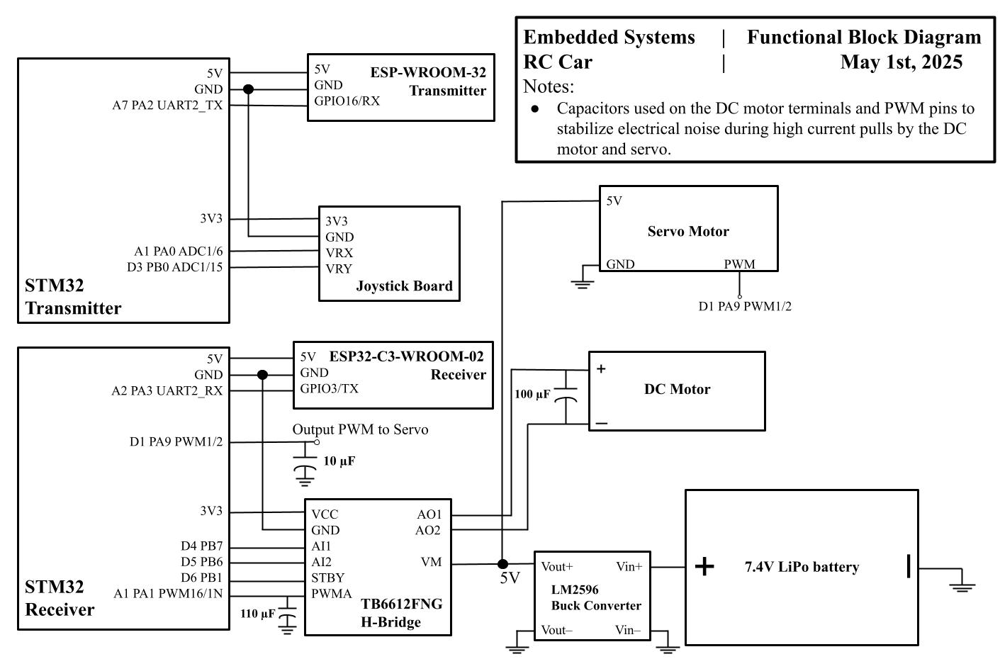
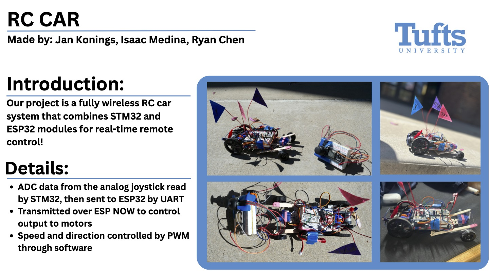
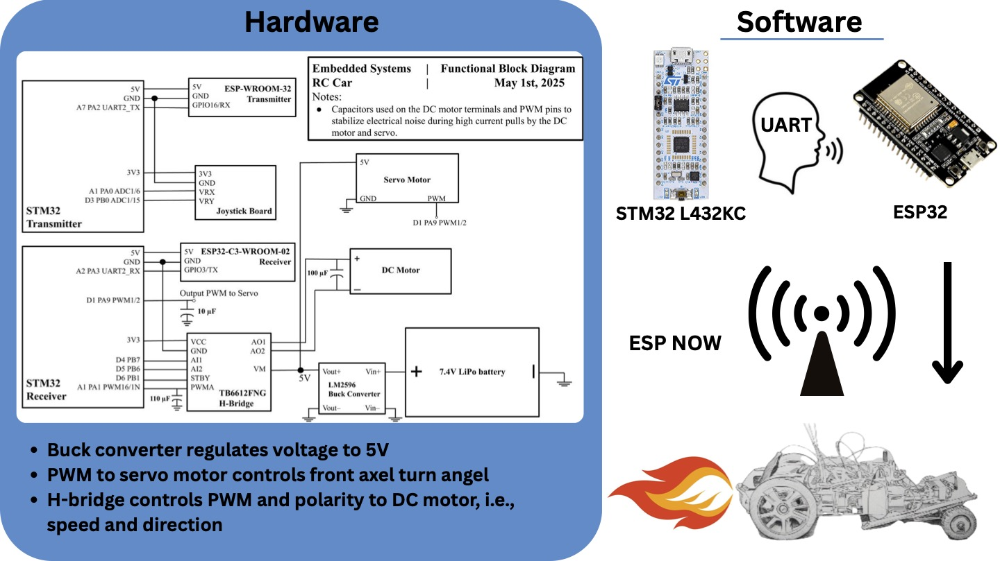

# EE14 Final Project: RC Car with STM32 & ESP32
### Made By: Isaac Medina, Jan Konings, and Ryan Chen
<table>
  <tr>
    <td></td>
    <td></td>
  </tr>
</table>

## Overview
This project showcases a remote-controlled (RC) car developed as the final project for EE14. The system integrates an STM32 microcontroller with ESP32 modules to facilitate low-latency wireless control. The STM32 captures joystick inputs and sends them over UART to an ESP32, which then relays the data via ESP-NOW to a second ESP32 on the car. The receiving ESP32 sends the data over UART to the receiving STM32, which controls motor outputs. 

## Features

- **Dual-MCU Architecture**  
  - STM32L432KC handles analog joystick sampling and UART framing  
  - ESP32 modules handle wireless ESP-NOW communication  

- **Low-Latency Wireless**  
  - ESP-NOW peer-to-peer protocol for sub-millisecond packet delivery  

- **Modular Code Structure**  
  - Separate folders for transmitter (STM32), intermediary (ESP32 to ESP32), and receiving STM32 
  - Clear build instructions for each  

## Hardware
- **Microcontrollers**
  - 2 STM32L432KCs - One for input data, and one for output to the motors.
  - 1 ESP-WROOM-32 (Used for transmission)
  - 1 ESP32-C3-WROOM-02 (Used for receiving data)
  - 1 Analog Joystick Board (Input data)
  - 1 TB6612FNG H-Bridge
  - 1 Servo Motor 
  - 1 Tamiya 72005 6-Speed Gearbox Kit DC Motor
  - 1 7.4V, 1000mAh/25C LiPo battery
  - 1 LM2596 Buck Converter
  - 100µF and 10µF capacitors
  
### Block Diagram:

## Software
- **Transmitter Side**
  - The transmitter side STM32 The transmitter-side STM32 uses its ADC to read analog joystick inputs (X and Y axes), packages them into a 4-byte struct, and sends the data over UART to the ESP- 
    WROOM-32.
  - The ESP-WROOM-32 transmitter decodes the bytes using a state machine and relays the data to a receiving ESP32 using the ESP-NOW wireless protocol.
- **Receiver Side**
  - The receiver-side ESP32 unpacks the struct and forwards it over UART to the second STM32.
  - The receiving STM32 interprets the data:
    - The X-axis controls the servo angle for steering via PWM.
    - The Y-axis controls motor direction (via H-bridge polarity) and speed (via PWM)
- **Tools and Langauges**
  - STM32s were programmed in Embedded C using PlatformIO.
  -  ESP32s were programmed in C++ using the Arduino IDE.
  -  Data is transmitted as a 4-byte struct: two bytes for the joystick’s X value and two for the Y value, using little-endian formatting.

### Project Showcase Flyers:
<table>
  <tr>
    <td></td>
    <td></td>
  </tr>
</table> 
