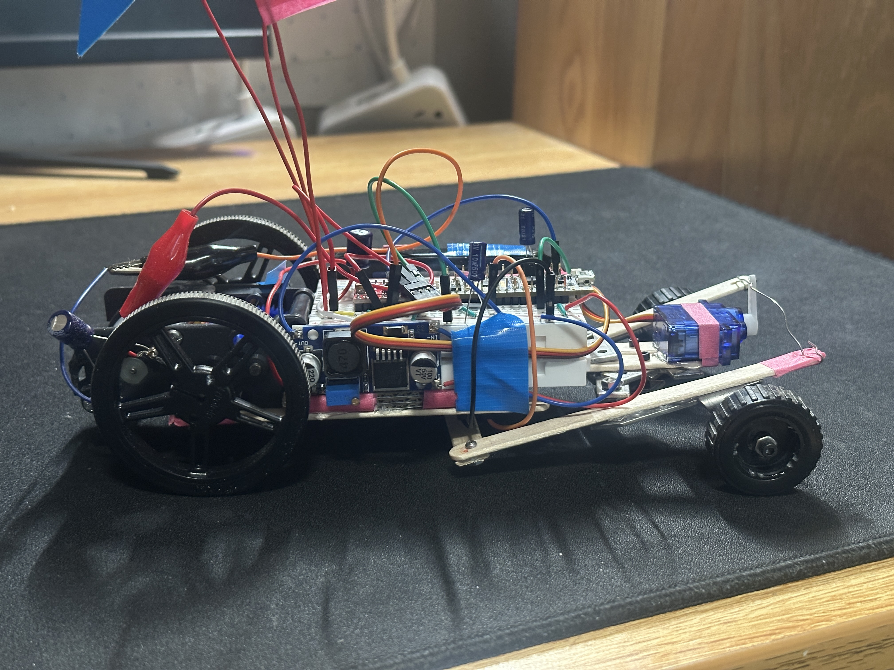
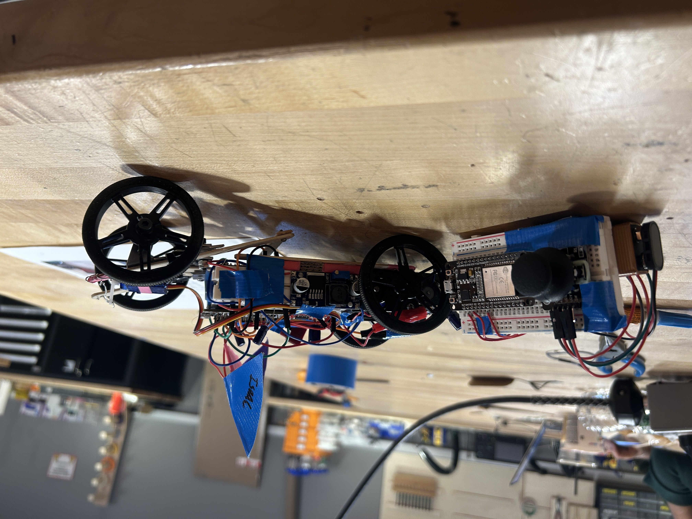

# EE14 Final Project: RC Car with STM32 & ESP32

<table>
  <tr>
    <td></td>
    <td></td>
  </tr>
</table>

## Overview

This project showcases a remote-controlled (RC) car developed as the final project for EE14. The system integrates an STM32 microcontroller with ESP32 modules to facilitate low-latency wireless control. The STM32 captures joystick inputs and sends them over UART to an ESP32, which then relays the data via ESP-NOW to a second ESP32 on the car.

## Features

- **Dual-MCU Architecture**  
  - STM32F103 handles analog joystick sampling and UART framing  
  - ESP32 modules handle wireless ESP-NOW communication  

- **Low-Latency Wireless**  
  - ESP-NOW peer-to-peer protocol for sub-millisecond packet delivery  

- **Modular Code Structure**  
  - Separate folders for transmitter (STM32), intermediary (ESP32), and receiver (ESP32)  
  - Clear build instructions for each  

## Repository Structure

